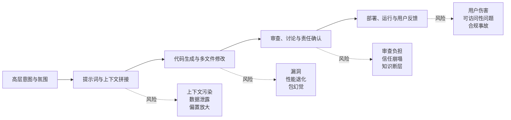
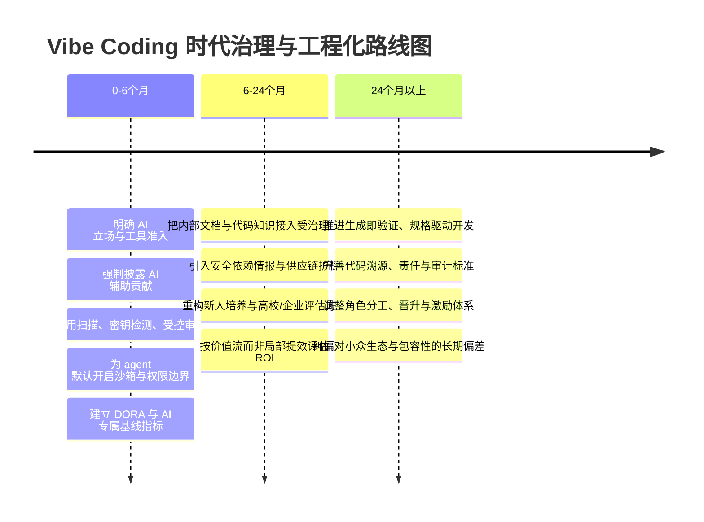

# Vibe Coding 时代需要解决的问题

## 执行摘要

本报告将“vibe coding”界定为：以自然语言、高层意图和“先把东西做出来”的氛围驱动，由 AI/agent 生成、修改并解释代码，而人类更多承担目标设定、约束、验证、集成与责任归属的软件开发实践及协作文化。中文语境并无统一、稳定的学术定义；官方中文资料普遍把它描述为从“逐行写代码”转向“通过对话引导 AI 生成、完善和调试应用”的工作流。该术语通常追溯到前 urlOpenAIhttps://openai.com 联合创始人 entity["people","Andrej Karpathy","AI researcher"] 在 2025 年初的表述。citeturn12view12turn12view13

核心判断是：vibe coding 时代最需要解决的，不是“模型会不会写代码”，而是“如何把生成速度转化为可验证、可维护、可协作、可合规、可持续的交付能力”。urlGoogle Cloudturn12view12 的 DORA 研究明确把 AI 辅助开发描述为“系统问题，而不是工具问题”；与此同时，像 urlGitHubturn14view1 的 entity["software","GitHub Copilot","AI coding assistant"] 和 urlAnthropicturn13view9 的 entity["software","Claude Code","agentic coding tool"] 这类工具，已经可以读取代码库、运行命令、连接外部系统，甚至在托管环境中自主研究仓库、修改分支并发起 PR，这使错误、泄露、供应链污染和责任不清的影响半径显著放大。citeturn19view3turn13view9turn13view10turn13view11

已有证据说明，这些问题并非抽象担忧。针对资深开源开发者的随机对照研究发现，允许使用 2025 年前沿 AI 工具后，任务完成时间反而增加了 19%；另一项研究发现，AI 采用后核心维护者审查代码量增加 6.5%，原创代码生产率下降 19%。在供应链层面，USENIX 2025 的研究显示，代码生成模型中的“包幻觉”是系统性现象，19.7% 的生成包名是虚构的；另有研究表明，主流语言和框架获得更高成功率，AI 可能进一步加剧生态锁定。citeturn15view0turn15view8turn15view5turn15view2turn15view3

据此，本报告的结论是：短期优先级应集中在“安全、审查信任、数据与权限治理、最小可验证交付”；中期优先级应转向“内部上下文平台化、教育与评估重构、组织级 KPI”；长期才是“生成即验证、标准化溯源、角色与激励体系重塑”。否则，vibe coding 带来的不会只是速度红利，更可能是维护债、安全债、合规债和组织债的同时累积。citeturn19view2turn19view3turn22view4

## 定义、范围与研究假设

“vibe coding”至少有四层含义。技术层面，它是对话式、意图驱动的编码：开发者不再持续逐行实现，而是让 AI 在多文件、多轮上下文中写、改、调、测。文化层面，它是一种容忍模糊、强调探索与快速原型的协作氛围。产品层面，它对应 IDE、CLI、cloud agent、MCP 连接器、自动 code review 等整套工具链。社区层面，它对应“AI 贡献是否应披露、谁负责、维护者如何筛噪、是否允许低理解度 PR 进入仓库”的新治理问题。citeturn12view12turn12view13turn13view9turn13view10turn13view11

本研究采用的工作性假设是：**若无特别说明，vibe coding 指“一种以情感/氛围驱动的编码实践与协作文化”，其工程化落地形式是由 AI coding assistant/agent 根据自然语言意图生成和修改代码，而人类对结果承担最终理解、验证与责任。** 之所以采用这一假设，是因为中文语境尚未形成统一定义，而当前官方中文材料与工具文档的共同点，正是“高层意图输入 + AI 代码产出 + 人类验证收口”的结构。citeturn12view12turn12view13turn13view9turn13view11

本报告还明确以下未指定项与边界条件：

- 默认讨论对象是面向企业研发团队、开源社区和高校人才培养场景中的 AI 辅助软件开发，而不是单纯的个人玩具项目。citeturn19view3turn16view1
- 默认工具范围包括代码补全、代码对话、托管 agent、自动 code review、MCP 工具接入与依赖智能，而不限于单一模型或单一 IDE。citeturn13view9turn13view10turn13view11turn22view0
- 治理与法律合规部分默认采用“跨司法辖区团队”的视角，至少覆盖中国对生成式 AI 与数据出境的要求，以及 entity["organization","European Union","supranational organization"] 对 GPAI 模型提供者的义务框架。citeturn12view7turn12view8turn7search3
- 本报告的时间语境主要对应 2025—2026 年 AI coding assistant/agent 从“补全工具”加速走向“可执行代理”的阶段。citeturn13view9turn13view11turn19view3

从工程链路看，vibe coding 时代的问题并不是孤立出现的，而是沿着“意图输入 → 上下文注入 → 代码生成/修改 → 审查协作 → 部署运行”逐段放大。下面的示意图概括了这一问题链。相关风险节点来自 DORA、真实 IDE 会话研究，以及当前 agent 工具的运行方式。citeturn19view3turn17academia28turn13view9turn13view10turn13view11

官方图示可参见 urlDORA AI Capabilities Model 官方页turn19view1 与 urlClaude Code 沙箱架构turn14view4。

## 问题全景与问题清单

下表按照“影响面 × 可行性”综合排序。优先级含义为：**高**表示应在 0—6 个月处理；**中高**表示应进入 6—24 个月主路线；**中**表示更适合在基础治理成型后推进。表中优先级依据综合了维护者负担、安全可验证性、合规暴露面、对终端用户的潜在伤害，以及组织能否在现有流程中快速落地。citeturn20view0turn20view1turn19view2turn19view3turn15view5

| 问题 | 类别 | 影响 | 利益相关者 | 优先级 |
|---|---|---|---|---|
| 需求到实现的语义漂移 | 技术、产品 | 真实 IDE 会话研究表明，AI 辅助编程往往以“渐进式规格”推进，开发者不断修正而非一次性明确需求；这会把验证成本从“写代码”转移到“解释目标与检查偏差”。citeturn17academia28turn13view9 | 产品经理、开发者、测试、架构师 | 高 |
| 可复现性与版本漂移 | 技术 | 模型版本、上下文长度、规则文件、工具连接器都会改变输出；DORA因此把强版本控制、小批次、回滚能力视为 AI 成功放大器。citeturn19view2turn18view4 | 开发者、SRE、平台团队 | 高 |
| 安全漏洞与依赖供应链污染 | 技术、安全、治理 | 包幻觉、过期依赖、伪造依赖与规则文件后门可直接把风险带进仓库；USENIX 研究和中文技术媒体均证明这是现实攻击面。citeturn15view5turn22view0turn22view3 | 安全团队、平台团队、终端用户 | 高 |
| 权限过大与上下文泄露 | 技术、治理、合规 | agent 工具已经能读仓库、跑命令、连外部系统；若无文件与网络双重隔离，敏感代码、密钥与内部文档可能被导出。citeturn13view9turn13view10turn14view4 | 安全、法务、研发管理、客户 | 高 |
| 审查信任模型破裂 | 协作与沟通 | GitHub 维护者讨论直接指出“review trust model is broken”；社区政策普遍转向“披露 AI 使用 + 人类验证 + 提交者承担全部责任”。citeturn20view1turn20view0turn13view7turn13view8 | 维护者、审查者、核心开发者 | 高 |
| 异步沟通噪声与维护者心理负担 | 协作与社区 | low-effort AI PR 会挤占异步协作带宽，freeCodeCamp 与 GitHub 社区讨论都记录了 AI 噪声如何稀释有效评审与社区善意。citeturn13view4turn20view2 | 开源维护者、新贡献者、社区管理者 | 高 |
| 知识共享与代码所有权稀释 | 协作、人才 | 当 AI 代写比例上升，团队可能更快地产出“可运行代码”，却更慢地建立“可解释知识”；企业案例和论文都显示 onboarding、遗留系统理解与维护负担是主痛点。citeturn18view1turn15view8 | 新员工、核心开发者、技术经理 | 高 |
| 偏见、生态锁定与包容性不足 | 伦理与社会、技术 | AI 对主流语言/框架支持更强，对小众技术栈形成额外摩擦；学生研究还显示熟悉度、性别、经验会影响使用方式与收益。citeturn15view2turn15view3turn16view1 | 小众生态、学生、招聘方、开源项目 | 中高 |
| 学习替代与评估失真 | 教育与人才 | 学生会把 AI 当作学习伙伴，但过度依赖风险与能力层级密切相关；传统只看结果的作业评估会越来越失真。citeturn16view0turn16view1 | 高校、培训机构、学生、雇主 | 高 |
| 用户体验、可访问性与验证缺口 | 产品与用户体验 | 可访问性研究显示，初学者常常不会主动要求 AI 关注无障碍，也缺乏验证能力；“能生成 UI”不等于“能交付合格体验”。citeturn17academia30 | 终端用户、残障用户、设计师、QA | 中高 |
| 知识产权、数据与法律责任 | 治理、法律合规 | 欧盟要求 GPAI 提供者具备技术文档、版权政策与训练内容摘要；中国要求标识、投诉举报、安全稳定服务与违法内容处置；同一工具不同订阅计划对训练数据使用和数据保护也可能不同。citeturn12view7turn12view8turn21view1turn21view2 | 法务、采购、信息安全、供应商管理 | 高 |
| 成本、Token 消耗与可持续性 | 商业化与可持续性 | 如果没有防护栏，返工、安全修复、误审与错误依赖会吞掉交付红利；DORA也提醒，局部效率提升若不进入价值流治理，可能变成下游混乱。citeturn22view0turn19view3 | 研发管理层、财务、平台团队 | 中高 |

## 证据与案例

### 社区案例

社区端最突出的现象，是“维护者时间”成为稀缺资源而非无限资源。urlBeyond All Reason AI 政策turn20view0 明确要求：所有 AI 辅助代码都必须显式披露，必须由人类完整验证，并把“vibe coding”直接定义为“未经过足够理解、验证和责任承担就提交 AI 代码”的行为；政策存在的理由不是反 AI，而是防止维护者时间被低质量、未验证、不可解释的贡献占用。citeturn20view0

类似的担忧在更大开源生态中广泛存在。urlOpenCV 议题turn12view1 讨论中，贡献者明确提出“提交者必须知道代码在做什么，并对 PR 描述和代码承担全部责任”；urlfreeCodeCamp 议题turn12view0 则把 AI 生成、低投入、无视模板的 PR 直接标记为“deprioritized”。在 urlGitHubturn14view1 官方社区讨论中，维护者更直白地说：AI 时代“审查信任模型已经破裂”，审查者不能再默认作者理解自己提交的代码，而且 line-by-line review 仍然是必须的，却越来越难扩展。citeturn13view4turn13view7turn13view6turn20view1

这说明社区层面的核心问题不是“是否允许 AI”，而是**如何维持透明、责任和异步协作的可持续性**。如果没有披露、测试工件、提交者责任和小批次审查，AI 会把“贡献门槛降低”迅速变成“维护者负担上升”。这是典型的外部化成本问题。citeturn20view0turn20view1turn19view2

### 企业案例

企业侧的高置信度结论是：**AI coding assistant 的价值不是自动出现的，而是被治理、平台和安全能力“放大”出来的。** 在 urlGoogle Cloudturn12view12 披露的 urlDun & Bradstreethttps://www.dnb.com 案例中，企业引入 entity["software","Gemini Code Assist","AI coding assistant"] 的前提不是“功能更炫”，而是对私有数据保护、代码安全护栏、租户隔离式代码引用存储、加密日志与细粒度管理控制的审核；在此基础上，其早期内部指标显示开发者生产率提升约 30%，同时改善代码质量、应用现代化与新人上手速度。citeturn18view1turn18view3

另一方面，agent 化工具也在主动把“安全边界”产品化。urlAnthropicturn13view9 为 entity["software","Claude Code","agentic coding tool"] 增加了文件系统和网络双重隔离的沙箱，并说明如果缺少其中任何一层，受污染的 agent 就可能导出 SSH key 或逃逸到网络；它还披露，用户对权限弹窗的接受率高达 93%，这意味着纯手工审批很容易演化为“批准疲劳”。citeturn14view4turn14view5

同样，urlGitHubturn14view1 在文档中把组织级策略、content exclusion、自动 code review、公共代码匹配引用、托管环境运行等能力明确制度化，并强调“Copilot 生成的 PR 也应得到与任何贡献同样严格的审查”。这些企业实践说明，真正有效的解决方案不是放权给 agent，而是把 agent 约束在**可配置的边界、可审计的流程和可回滚的交付节奏**之内。citeturn14view1turn14view0turn13view8turn21view0turn21view1

### 学术案例

学术研究给出的信息是：AI 编码工具的收益高度依赖任务类型、团队结构和用户能力层级，而不是单向“普遍提效”。针对资深开源开发者的随机对照实验显示，参与者原本预期 AI 能节省时间，但真实结果是任务完成时间增加 19%。另一项关于 Copilot 采用前后的开源研究发现，外围开发者产出可能增加，但核心维护者要额外审更多代码，原创代码生产率下降 19%，维护负担被转嫁给少数专家。citeturn15view0turn15view8

在技术质量层面，USENIX 2025 论文表明，package hallucination 是系统性问题：对 16 个模型、57.6 万份 Python/JavaScript 代码样本的评估显示，商业模型平均至少 5.2% 的包是幻觉，开源模型至少 21.7%，总体上 19.7% 的生成包名是虚构的；另一篇研究指出，主流语言和框架获得显著更高成功率，小众栈被置于结构性劣势。与此同时，关于认知偏差的研究还发现，LLM 相关交互更容易触发新型偏差，48.8% 的程序员动作带有偏差迹象。citeturn15view5turn15view2turn15view3turn15view7

在教育与 UX 层面，研究也没有给出“学生只会作弊”这样简单的结论。urlGoogle Cloudturn16view0 关于 UC Berkeley 学生的研究表明，很多学生把 AI 当作学习伙伴，会主动在某些环节关闭 AI；但另一项关于开源课程作业的研究发现，编程熟练度、熟悉度与性别都会影响使用方式与感知收益，并明确提示低熟练度学生更容易过度依赖或错误依赖 AI。无障碍方向的研究则显示，即便 AI 能生成 UI，开发者仍常常不会为无障碍而提示模型，也缺少验证能力。citeturn16view0turn16view1turn17academia30

学术证据因此支持一个更稳妥的判断：**vibe coding 的主要挑战不是“能不能生成”，而是“谁来验证、谁来维护、谁承担长期后果”。** citeturn15view0turn15view8turn15view5

## 现有解决方案与最佳实践

下表把现有方案按“工具、流程、政策、培训”四类整合，并给出优缺点与适用场景。整体上，最有效的不是单个工具，而是把它们组合成一条“生成前约束—生成中隔离—合并前验证—上线后回溯”的治理链。citeturn19view2turn19view3

| 方案 | 主要内容 | 优点 | 局限 | 适用场景 |
|---|---|---|---|---|
| 受控运行时与权限边界 | 沙箱、网络/文件 allowlist、托管环境、content exclusion、组织级策略控制。citeturn14view4turn14view1turn14view0 | 直接缩小 blast radius，适合 agent 工具 | 初始配置成本高，开发体验会变严 | 高价值代码库、受监管行业、代理式工作流 |
| 合并前安全与供应链护栏 | code scanning、secret scanning、依赖审查、公共代码引用日志、安全依赖情报、MCP 安全数据接入。citeturn6search34turn6search26turn21view1turn22view0 | 能把“生成速度”转为“可验证速度” | 误报、漏报与集成复杂度仍需要人工吸收 | Web 应用、后端服务、依赖密集型项目 |
| 透明协作协议 | AI 使用披露、Assisted-by/模板字段、人类责任条款、测试工件、同等审查标准、小批次提交。citeturn20view0turn13view8turn19view2 | 立刻修复信任模型，维护者成本可控 | 初期会降低提交便利性，可能引发反感 | 开源社区、跨时区异步协作团队 |
| 内部上下文平台化 | 健康数据生态、内部文档/代码库接入、受治理的 MCP、优质内部平台。citeturn19view1turn19view2turn13view10turn18view3 | 降低通用模型的“空想式输出”，改善上手和知识共享 | 最大投入在数据治理，不在模型本身 | 中大型企业、遗留系统、知识密集型团队 |
| 培训与评估重构 | 教“验证优先”而非“提示优先”；用代码走查、口头追问、调试说明、威胁建模、无障碍检查替代单看结果。citeturn16view0turn16view1turn17academia30 | 保留真实学习与代码所有权 | 教师、审查者与经理的时间投入增加 | 高校课程、校招训练营、新人培养 |
| 供应商与合同治理 | 区分个人版/企业版训练数据政策，审查零数据保留、DPA、版权政策、数据出境路径。citeturn21view2turn21view3turn12view7turn12view8turn7search3 | 直接降低法律与采购风险 | 谈判与采购周期长，存在供应商锁定 | 企业采购、跨境研发、合规敏感组织 |

在这些方案里，**最佳实践并不是“多装几个 AI 工具”，而是优先做三件事**：第一，把 AI 使用政策说清楚；第二，把 agent 的权限边界收紧；第三，把“测试、扫描、审查、回滚”放到所有 AI 代码之前。DORA 的七项能力、社区治理实践和企业案例都共同指向这一点。citeturn19view2turn19view3turn20view0turn18view3

## 优先级与路线图

优先级排序依据是：**先处理“高破坏性、低争议、可立即落地”的问题，再处理“中长期组织能力建设”，最后才是“生态级标准化和角色重塑”。** 这意味着短期要优先安全、审查信任和合规，避免组织在还没有验证链路时就把 agent 大规模推上生产。citeturn19view3turn15view5turn20view1

### 短期重点

短期应完成五项动作：发布组织级 AI stance；建立允许/禁止工具矩阵；对 AI 贡献强制披露；对高价值仓库启用 branch protection、code scanning、secret scanning、依赖审查与小批次 PR；默认将 agent 放进沙箱或受控托管环境。这样做的目标不是压制效率，而是先恢复**可追踪、可解释、可回滚**。citeturn19view2turn14view1turn14view0turn13view8turn14view4

建议 KPI：

- 已发布并被团队确认的 AI 使用政策覆盖率
- AI 辅助 PR 披露率
- 受保护仓库中扫描覆盖率、密钥泄露事件数
- AI 辅助 PR 的中位变更规模与审查时长
- AI 辅助变更的回滚率、变更失败率、恢复时间  
  这些指标与 DORA 的软件交付指标兼容，适合用作 0—6 个月基线。citeturn18view4turn3search0

### 中期重点

中期的关键不再是“有没有上 AI”，而是“AI 是否接入了正确的组织上下文、是否纳入了价值流、是否改善了学习与协作”。应优先建设受治理的内部知识接入、MCP 工具白名单、安全依赖情报、组织级平台支持，并把培训从“会不会 prompt”升级为“会不会验证、会不会解释、会不会做威胁建模与用户验证”。citeturn13view10turn22view0turn19view1turn16view1turn17academia30

建议 KPI：

- 新人上手时间、遗留系统理解时间
- AI 辅助 PR 的重开率、补丁返工率
- 依赖幻觉/错误依赖事件数
- AI 辅助交付与非 AI 交付在 DORA 指标上的差异
- AI 培训通过率、代码走查通过率、无障碍缺陷率  
  中期最重要的是看“质量与用户价值是否同步改进”，而不是只看建议接受率或生成代码行数。citeturn17academia31turn19view3

### 长期重点

长期路线应转向更高阶的工程与治理：规格驱动生成、生成即验证、代码来源与责任溯源、跨工具/跨供应商标准，以及与岗位能力模型、绩效评价、晋升机制相匹配的角色重塑。学术研究已经表明，长期维度里的“技术判断、所有权、维护能力”比短期输出速度更能决定真实 productivity。citeturn17academia31turn15view8

建议 KPI：

- 高严重漏洞密度
- AI 辅助代码的多年维护成本、缺陷回归率
- 高风险系统中“有规格、有测试、有回滚方案”的 AI 变更占比
- 小众语言/框架项目中的 AI 成功率与采用率差距
- 与法律审计相关的溯源完备率、投诉闭环时效  
  长期重点不是“更像自动驾驶”，而是“更像受约束、可审计的工程系统”。citeturn15view2turn12view7turn12view8

## 风险、反弹与未解问题

### 关键风险

最现实的反弹不是技术失败，而是**治理失衡**。如果组织把 AI 当成纯效率工具，短期确实可能看到产出增加，但很快会遇到四种反弹：维护者与核心开发者抵触、影子 AI 泛滥、法务与采购收紧、终端用户对质量和安全失去信任。开源社区已经出现要求封禁 AI PR、迁出平台或直接关闭入口的声音；企业侧则会以更加严格的 DPA、零数据保留、训练策略审查和供应商分级来回应。citeturn20view2turn20view1turn21view2turn21view3

另一个高风险点是**指标误导**。如果 KPI 仍然只看代码行数、suggestion acceptance、PR 数量，组织会被“更多代码”误导成“更多价值”。DORA 明确强调 AI 的收益只有在价值流和用户中心视角下才会转成产品表现；缺乏用户中心时，AI 甚至可能让团队“更快地朝错误方向前进”。citeturn19view2turn19view3

### 开放问题与局限

仍然没有被充分解决的问题至少有五个。第一，如何稳定衡量 AI 代码在一年以上周期中的维护成本，而不是只看当周交付速度。第二，如何建立跨工具、跨组织可互认的代码溯源与责任标准。第三，如何在保护学习的同时，不把弱势群体与非传统开发者排除在 AI 红利之外。第四，如何纠正对主流语言与框架的偏好，避免 AI 把软件生态进一步推向单一化。第五，如何让安全、性能、可访问性和合规验证在生成阶段就发生，而不是继续依赖后置人工补丁。citeturn15view2turn15view3turn16view1turn17academia30turn17academia31

本报告的局限是：它优先覆盖了通用软件开发、开源协作和高等教育场景，没有展开金融、医疗、车规等行业的细则，也没有逐一展开中国各行业主管部门的分业监管指引。因此，行业敏感组织在落地时仍需把本报告的路线图映射到本行业的审计、留痕、数据分类分级和外包/采购规则。citeturn12view8turn7search3turn7search15