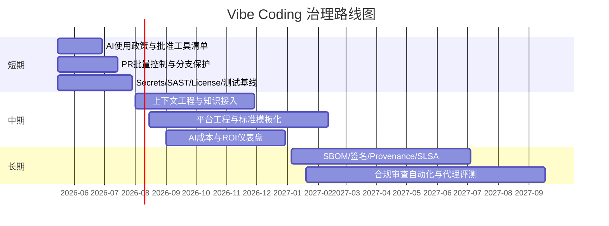

# Vibe Coding 时代需要解决的问题及其解决方案研究报告

## 执行摘要

“Vibe Coding 时代”目前并不是一个有统一行业标准的正式术语。词典层面，entity["organization","Collins Dictionary","English dictionary publisher"] 将其概括为“用自然语言让 AI 生成代码”的新型开发方式，而 entity["organization","Merriam-Webster","dictionary publisher"] 强调它往往意味着开发者并不充分理解代码为何成立、却依赖 AI 继续推进；到了生产语境，entity["organization","NCSC","UK National Cyber Security Centre"] 则把它视为可能改变软件生产方式、乃至影响 SaaS 供给结构的一类“AI 生成软件”范式。与此同时，2025 年开发者调查显示，84% 的受访者已经在用或计划使用 AI 工具，90% 的技术从业者已在工作中使用 AI，但这并不等于“可直接大规模上生产”。citeturn24search0turn24search1turn20view2turn21view0turn28view2turn23search17

当前最突出的矛盾，不是“AI 会不会写代码”，而是“AI 写出来的代码如何被安全、稳定、合规、可维护地交付”。研究与官方指南已经反复指出：AI 会显著放大组织原有优点和缺点；它可以提升个体效率与心流，也会因为批量变大、验证不足、上下文缺失而拉低交付吞吐与稳定性。开发者最常见的抱怨包括“答案几乎正确但差一点”（66%）和“调试 AI 生成代码更费时”（45%）；在代理化场景下，又进一步叠加提示注入、敏感信息泄露、过度授权、依赖幻觉、密钥泄漏、供应链完整性不足等问题。citeturn20view1turn29view0turn34view0turn35view0turn36view0turn14search0

因此，本报告的核心结论是：Vibe Coding 时代真正要建设的不是“更会写提示词的人”，而是“从自由 vibe 到受控 production”的一整套社会技术系统。最有效的路径不是全面放开，也不是一刀切禁止，而是先把组织的 AI 立场讲清楚，再把上下文工程、小批量交付、自动化验证、最小权限、供应链证据、用户与合规检查、成本度量和培训体系一起做起来。按照这一思路推进，AI 才更可能成为交付能力与组织学习能力的放大器，而不是把技术债、安全债和治理债提前透支。citeturn27view2turn27view3turn27view4turn34view2turn34view3turn8search1

## 定义与范围

本报告采用“三种解释并行、一个主假设落地”的方式来界定“Vibe Coding 时代”。主分析假设是：企业已经或即将把 AI 代码助手、代码代理、云端代理、自然语言驱动的应用生成能力引入真实的软件交付流程，而不仅仅是用于实验性 demo。这个假设最贴近当前主流工具和官方治理讨论。citeturn24search0turn24search1turn20view2turn21view0turn5search2turn16search1turn18search12

| 可能解释 | 含义 | 范围 | 本报告中的假设 |
|---|---|---|---|
| 技术潮流 | 用自然语言、上下文工程、代码代理与自动化工具来生成、修改、评审和部署代码；从 IDE 补全走向 CLI / 云端 / 多代理协作。citeturn24search0turn5search2turn16search1turn18search12 | 工具链、架构、CI/CD、测试、安全、观测 | **主分析对象** |
| 文化现象 | “会写语法”不再是唯一核心竞争力，提示、分解、评审、验证、知识组织、风险判断变得更重要；同时伴随信任焦虑、角色边界变化与学习压力。citeturn24search1turn20view1turn29view0turn37view1 | 团队协作、远程工作、培训、招聘、心理安全 | **强相关维度** |
| 产品范式 | “买 SaaS 还是自建系统”的边界被改写，企业会更频繁地选择“足够像定制、但成本更低”的内部工具或轻量应用。公共产品侧则出现面向非程序员的“vibe app”体验。citeturn21view0turn30search0 | 用户体验、产品运营、商业模式、ROI、合规 | **延伸分析对象** |

如果要用一句话概括本报告的范围，可以写成：**Vibe Coding 时代 = AI 辅助编码 + 代理化软件交付 + 开发文化与产品供给方式重构的叠加阶段**。它的边界不只在“写代码”，而是在“谁来决定、谁来验证、谁来负责、谁来承担风险与成本”。citeturn20view2turn21view0turn20view1turn27view2

## 主要问题清单

| 编号 | 维度 | 需要解决的问题 | 简短证据或典型来源 |
|---|---|---|---|
| T1 | 技术 | **上下文缺失与代码幻觉**：生成结果不知道你们的真实架构、约束、内部 API、历史设计决策，容易“看起来对、实际上错”；还会出现捏造依赖、包名幻觉。 | 开发者对“几乎正确但差一点”的抱怨占 66%；entity["organization","DORA","software delivery research program"]指出 AI 访问内部数据会显著放大代码质量与个体效率；USENIX 研究系统性指出代码模型存在 package hallucination 风险。citeturn29view0turn27view3turn36view0 |
| T2 | 技术 | **架构漂移与技术债加速**：AI 擅长补洞与扩写，不天然擅长长期架构一致性，容易把过时模式、重复实现和偶然设计复制到更多位置。 | entity["organization","NCSC","UK National Cyber Security Centre"]明确指出，当前 vibe coding 代码常被评价为“不可靠、难维护、可能有关键问题”；DORA 也强调 AI 会放大高绩效与低绩效组织原有模式。citeturn21view0turn20view2turn27view3 |
| T3 | 技术 | **性能与资源低效**：代码功能正确并不等于性能、复杂度、运行成本合理。 | FORGE 2024 研究指出，LLM 生成代码的效率与功能正确性并不等价；更细致的逐步提示才更可能改善复杂任务下的效率。citeturn36view1 |
| T4 | 技术 | **供应链与依赖完整性脆弱**：捏造依赖、恶意包、许可证混入、组件来源不清，都会让 AI 代码把风险写进制品。 | entity["organization","OWASP","application security nonprofit"]把 LLM 供应链列为 2025 Top 10 风险之一；SLSA 把 provenance 视为供应链可信度基础；SPDX / CycloneDX 都把 SBOM 作为风险管理核心载体。citeturn35view0turn10search8turn10search10turn10search3 |
| T5 | 技术 | **提示注入、敏感信息泄露与过度代理**：一旦代理可以读文件、调工具、发命令，外部文档/文件/网页中的隐式指令就可能诱导越权动作。 | OWASP LLM01:2025 指出提示注入可导致敏感信息暴露、未授权函数访问、执行任意命令；Claude Code 与 GitHub Copilot 都支持通过 MCP / 代理接入外部工具系统。citeturn34view0turn16search3turn25search14 |
| P1 | 流程 | **大批量提交让交付更慢更不稳**：AI 让开发者更快地产生大量代码，但 review、测试、集成并没有同步提速。 | DORA 报告显示，AI 采用率每上升 25%，吞吐下降 1.5%，稳定性下降 7.2%，一个重要解释就是批量变大、反馈回路变慢。citeturn20view1 |
| P2 | 流程 | **测试与验证滞后**：如果仍把 AI 当“写得更快的开发者”，而不是“需要更强验证的放大器”，问题就会在合并后暴露。 | DORA 强调需要把自动化测试和持续集成做得更快更强；GitHub 官方负责使用文档要求对 AI 生成代码做严格测试、IP 扫描与安全检查。citeturn20view1turn25search9 |
| P3 | 流程 | **部署与运行风险前移**：云端代理、后台代理与自动修复功能提升了效率，也让“未经充分审视的改动进入分支与 PR”更常见。 | GitHub cloud agent 能在仓库内研究、规划并直接改代码；NCSC 的 AI 安全开发指南把安全部署、运维、日志与更新管理列为单独生命周期阶段。citeturn5search2turn34view2 |
| C1 | 文化与组织 | **信任断层与协作边界不清**：个体感觉更快，不等于团队协作更顺；“谁对 AI 写的代码负责”常常没讲清楚。 | DORA 发现 39% 的开发者对 AI 只信一点点或根本不信；2025 调查显示 69% 的代理用户认可生产率提升，但只有 17% 认可“改善团队协作”。citeturn20view1turn29view0 |
| C2 | 文化与组织 | **远程协作下的知识沉淀不足**：远程/混合办公占比高时，若知识主要留在个人 prompt 与会话里，就更难复用与审计。 | 2025 调查显示 32.4% 的开发者远程工作，另有大量混合办公；DORA 2021 明确指出高质量内部文档与积极团队文化，会显著改善交付与降低 burnout。citeturn38view0turn26view0 |
| C3 | 文化与组织 | **学习负荷、岗位焦虑与训练缺失**：技能半衰期更短，但很多组织没有正式训练时间与升级路径。 | DORA 发现给予学习时间可带来 131% 的团队 AI 采用提升、缓解岗位焦虑可带来 125% 的采用提升；世界经济论坛预计到 2030 年 39% 的关键技能会变化。citeturn20view1turn37view1 |
| U1 | 产品与用户 | **把可用性、隐私、可访问性放到后置检查**：AI 能更快做功能，但用户价值与合规并不会自动出现。 | DORA 认为用户中心能力可带来 40% 更高组织绩效；entity["organization","W3C","World Wide Web Consortium"] WCAG 2.2 建议用可测试标准管理可访问性；数字产品若忽视无障碍与隐私，会直接削弱可用性与市场接受度。citeturn27view0turn33view0turn33view1turn29view3turn32view4 |
| L1 | 法律与伦理 | **个人信息、公开代码、版权/许可证、备案与跨境义务复杂化**：AI 生成不消灭责任，只会模糊责任边界。 | 《个人信息保护法》要求最小必要、透明与安全保障；《生成式人工智能服务管理暂行办法》要求安全、稳定、投诉机制，以及特定服务的安全评估/备案；GitHub 允许组织阻断与公开代码匹配的建议，并提供 code reference。citeturn32view2turn32view1turn32view0turn25search1turn25search4turn25search8 |
| B1 | 商业可持续性 | **成本、定价模式、替代性与 ROI 难题**：AI 工具从 seat 走向 usage/token 计费后，价值证明必须更精细。 | 2025 调查中，开发者放弃工具的首要原因是安全/隐私，第二是价格；GitHub 已宣布 2026-06-01 起 Copilot 转向 usage-based billing；Claude Code、Codex 和 Cursor 都提供额度/用量/分层计费与成本上限机制。citeturn29view3turn22search4turn18search0turn18search3turn18search6turn18search8 |

## 解决方案与实践

下表采用“以治理带实现、以实现带 KPI”的方式，把问题对应到最可执行的一组控制面。这里的关键词不是“禁止 AI”，而是“把 AI 写进工程系统”。这些做法与 entity["organization","NIST","National Institute of Standards and Technology"] 的 SSDF / AI RMF、entity["organization","NCSC","UK National Cyber Security Centre"] 的 AI 安全开发指南，以及 entity["organization","DORA","software delivery research program"] 的 AI 能力模型基本一致。citeturn8search1turn8search8turn34view2turn27view2turn27view3turn27view4

| 对应问题 | 解决方案 | 实施步骤 | 所需资源 | 风险与缓解 | 预期效果与 KPI | 依据 |
|---|---|---|---|---|---|---|
| T1 / T2 | **上下文工程与内部知识可达** | 盘点代码库、架构图、规范、运行指标；把高价值文档做成可引用上下文包；通过 MCP / 检索层接入，且做 ACL 与脱敏；把通用 prompt 固化成 team-level skills / instructions。 | 平台工程师、架构师、文档负责人 | 风险是把过时文档也喂给模型；缓解方式是版本化知识、上下文 TTL、文档 owner 制。 | 幻觉依赖数下降、首次回答命中率上升、onboarding 时间缩短。 | citeturn27view3turn16search3turn17search4turn5search19 |
| P1 / T2 | **小批量交付与任务分解** | 设定 PR 规模上限、要求 feature flag、主干开发、每日多次小改动合入；需求拆到可独立测试的最小单元；高风险模块禁用“大段一次性生成后整体提交”。 | 工程经理、代码所有者、CI 规则 | 风险是任务被切得过碎；缓解是要求每个批次都可独立验证、可回滚、可观察。 | 中位 PR 行数下降、lead time 下降、change failure rate 下降。 | citeturn27view4turn20view1 |
| P2 / T3 / U1 | **多层自动验证流水线** | 把 lint、类型检查、单测、集成测试、回归测试、性能 smoke、无障碍检查、安全扫描统一进 CI；高风险改动必须在 PR 前完成自动验证。 | 测试平台、CI/CD 维护者、QA | 风险是流水线变慢；缓解是按风险分层、缓存与并行化、把慢测试移到分阶段 gate。 | 自动测试通过率、escaped defects、性能回退数、accessibility blocker 数。 | citeturn20view1turn25search9turn33view0turn33view1 |
| T5 / P3 / L1 | **代理最小权限与沙箱执行** | 默认 read-only；写权限、命令执行、外部系统调用需分级授权；代理在独立 worktree / sandbox 中运行；敏感库、生产环境、密钥系统只允许短期证书与显式人工批准。 | 平台、身份与访问控制、AppSec | 风险是“太安全导致不好用”；缓解是按风险等级配置 normal / plan / auto-accept 等模式，并做审计。 | 高权限工具调用次数、未经授权失败率、生产密钥暴露数。 | citeturn34view0turn17search6turn5search2turn34view2 |
| T4 / L1 | **供应链证据化** | 生成 SBOM；对构建产物签名；记录 provenance；建立依赖 allowlist / denylist；许可证与漏洞扫描在 PR 阶段执行。 | 安全工程、CI/CD、构建系统 | 风险是接入复杂；缓解是先从核心服务做 L2 级别，再渐进提升。 | SBOM 覆盖率、签名覆盖率、未批准依赖占比、漏洞修复 SLA。 | citeturn10search8turn10search10turn10search3turn34view3 |
| C1 / L1 / B1 | **明确、可传播的 AI 使用政策** | 定义允许/禁止场景、数据分级、审批工具清单、公开代码匹配策略、日志保留与采购标准；政策要写进 IDE 模板、PR 模板、培训与入职文档。 | 工程管理、法务、隐私、安全 | 风险是过度管制导致 shadow AI；缓解是设置快速例外流程与季度复审。 | 已批准工具覆盖率、shadow AI 发现率、例外审批时长。 | citeturn27view2turn29view3turn25search4turn25search8 |
| C1 / P2 | **风险分级的人机协作审查** | 财务、身份、支付、权限、数据处理、外部接口等高风险改动必须人工审查；低风险改动先由 AI 预审，再由人做关键确认；代码所有权保持清晰。 | Code owners、资深工程师、AppSec | 风险是 reviewer 过载；缓解是把 AI review 前移到预筛阶段，只把高价值问题留给人。 | 高风险变更人工 review 覆盖率、review SLA、问题重开率。 | citeturn5search4turn5search10turn12search3turn19search2 |
| C2 / C3 | **正式训练时间与能力升级** | 为工程师安排固定学习时段；训练主题包括安全编码、架构判断、prompt/context 设计、评审技巧、运行时排障；以真实代码库项目做结业验收。 | L&D 预算、导师、内部课程库 | 风险是培训流于形式；缓解是绑定 capstone、认证与实际交付指标。 | AI trust score、课程完成率、考核通过率、采用率与缺陷率联动。 | citeturn20view1turn37view1turn37view2turn37view3 |
| U1 | **用户价值、隐私和无障碍左移** | 把“用户任务完成率、隐私影响、WCAG 2.2、移动端可访问性”写进验收标准；上线前做样本用户验证与无障碍回归。 | 产品经理、设计、QA、法务/隐私 | 风险是早期看起来变慢；缓解是先做最小合规检查表，再逐步细化。 | 任务成功率、投诉率、PIA 完成率、AA 阻断项数。 | citeturn27view0turn33view0turn33view1turn32view4turn32view2 |
| B1 | **AI FinOps 与供应商可替代性** | 按团队设 spend limit；记录每个模型/代理的 token、成功率、返工率与业务结果；优先衡量“每个已合并 PR 成本”和“每个有效缺陷修复成本”，而不是只看 token。 | 财务、平台、采购 | 风险是过早以成本压制探索；缓解是先设试点预算，按 ROI 复盘再扩容。 | AI spend / merged PR、模型切换成本、供应商集中度、预算偏差率。 | citeturn18search3turn18search9turn22search4turn18search6turn18search0 |

下面这张示意图，可以把“从 vibe 到 production”的控制链看清楚：先把目标和上下文准备好，再让 AI 生成，再通过自动验证与人工把关，最后把运行反馈重新回流到上下文系统。它不是一条“更快写代码”的流水线，而是一条“更快获得可信改动”的流水线。citeturn27view3turn27view4turn34view2turn34view3

关键 KPI 不宜只看“写码更快”，而应覆盖交付、质量、安全、用户价值与成本五类指标。以下表格中的基线由于用户未指定，统一标为“未指定”；目标值是建议起始线，而不是法律或行业强制值。KPI 选型主要参考 DORA、平台工程、无障碍与 AI 运营实践。citeturn23search19turn27view1turn33view2turn18search9

| KPI | 定义 | 基线 | 建议目标 |
|---|---|---|---|
| 中位 PR 更改行数 | 每个 PR 的中位改动规模 | 未指定 | < 400 行 |
| 变更前置 Lead Time | 从开始开发到可部署的中位时长 | 未指定 | 3 个月内下降 20% |
| Change Failure Rate | 上线后引发回滚/修复/事故的比例 | 未指定 | < 10% 或较基线下降 30% |
| MTTR | 故障恢复中位时长 | 未指定 | 较基线下降 30% |
| 自动化验证通过率 | PR 进入主干前全部 gate 的通过率 | 未指定 | > 95% |
| 高风险改动人工审查覆盖率 | 身份/支付/权限/数据处理类改动的人审占比 | 未指定 | 100% |
| Secrets 泄漏率 | 每千次提交发现的有效密钥泄漏数 | 未指定 | 3 个月内减半，长期趋近 0 |
| SBOM / 签名覆盖率 | 产物附带 SBOM 且有签名证明的比例 | 未指定 | > 90% |
| Accessibility Blocker | WCAG AA 阻断项数量 | 未指定 | 每次发布为 0 |
| AI Spend / Merged PR | 每个有效合并 PR 的 AI 成本 | 未指定 | 稳定下降或保持在预算内 |
| 开发者 AI 信任分 | 通过内部问卷衡量“信任但会验证”的比例 | 未指定 | > 70% |

## 优先级与路线图

优先级排序建议遵循三条规则：**先解决会把风险直接带进生产的问题，再解决放大组织摩擦的问题，最后解决规模化与成本优化问题。** 结合 DORA 关于“小批量”“清晰 AI 立场”“平台工程”的研究，以及开发者对价格、安全与可用性的实际偏好，最适合的节奏是：短期先建规则与门禁，中期补上下文与平台，长期做供应链证据化与自动审计。citeturn27view2turn27view4turn27view1turn29view3

| 工作流 | 影响力 | 难度 | 成本 | 建议阶段 |
|---|---|---|---|---|
| AI 使用政策与批准工具清单 | 高 | 低 | 低 | 0–3 个月 |
| 小批量交付与 PR / branch gate | 高 | 中 | 低 | 0–3 个月 |
| Secrets / SAST / License / 测试基线 | 高 | 中 | 中 | 0–3 个月 |
| 上下文工程与知识接入 | 高 | 中 | 中 | 3–12 个月 |
| 平台工程与标准模板化 | 中高 | 中高 | 中高 | 3–12 个月 |
| AI 成本与 ROI 仪表盘 | 中 | 中 | 中 | 3–12 个月 |
| SBOM / 签名 / provenance / SLSA | 中高 | 高 | 中高 | 12 个月以上 |
| 合规审查自动化与代理评测体系 | 高 | 高 | 高 | 12 个月以上 |

如果只能抓一条主线，最值得先做的是：**“把 AI 代码从‘直接写进主干’改为‘必须经过统一 gate 的可审计改动’。”** 这是对技术、流程、文化、法务和成本五个维度同时有效的最小行动集。citeturn20view1turn34view2turn34view3

## 工具与技术栈建议

最佳参考方案是**以 GitHub 为中心的平台式受控栈**：代码仓库、PR、自动化、代理、代码审查、安全扫描和度量尽量放在同一治理面上，这样最能降低落地摩擦，也最便于做权限、审计、成本与证据统一管理。这个建议并不意味着别的工具不能用，而是意味着在组织刚进入 Vibe Coding 阶段时，**治理集成度**比**单点能力峰值**更重要。citeturn27view1turn5search2turn5search4turn25search16turn22search4

| 栈层 | 推荐工具/平台 | 适用场景 | 替代选项 |
|---|---|---|---|
| 代码平台与主治理面 | urlGitHub 平台https://github.com | 仓库、PR、Actions、云端代理、规则策略、使用度量统一管理；适合从试点走向组织级治理。citeturn5search2turn5search4turn5search12turn22search4 | urlGitLab Duohttps://about.gitlab.com/solutions/duo/ |
| 代码代理 | urlClaude Codeturn16search1 | 需要 CLI / IDE / 浏览器多入口、MCP、权限模式、团队花费控制时。citeturn16search3turn17search6turn18search3 | urlCodexturn18search12 |
| IDE 体验强化 | urlCursorhttps://cursor.com | 需要更强 IDE 代理体验、cloud agents、privacy mode、技能与 hooks 时。citeturn4search10turn4search13turn18search0 | 沿用现有 IDE + Copilot / Claude 插件 |
| 上下文协议 | urlMCPturn14search2 | 把 issue、监控、文档、数据库、企业工具安全地接给代理。citeturn14search6turn25search14 | 自研工具调用层 |
| 安全框架 | entity["organization","NIST","National Institute of Standards and Technology"] SSDF / AI RMF + entity["organization","OWASP","Open Worldwide Application Security Project"] GenAI Top 10 | 适合做治理基线、审查清单、风险建模。citeturn8search1turn8search8turn35view0 | 内部安全规范，但建议映射到公开框架 |
| 供应链证据 | urlSLSAhttps://slsa.dev + urlSPDXhttps://spdx.dev + urlCycloneDXhttps://cyclonedx.org | 需要 provenance、SBOM、许可证和漏洞联动治理。citeturn10search8turn10search10turn10search3 | 只做漏洞扫描，但不建议停在这一步 |
| 可访问性基线 | entity["organization","W3C","World Wide Web Consortium"] WCAG 2.2 | Web / App 产品要把可访问性做成可测试 gate，而不是手工补救。citeturn33view0turn33view1 | 内部 UI checklist，但需对齐 WCAG |

如果团队还没有组织级平台能力，最务实的做法是：**先使用一个治理面统一的代码平台，再把代理、MCP、SBOM 和成本控制逐步接入**；不要一上来就多工具并存、多人各用各的代理与插件。citeturn27view1turn27view2turn29view3

## 组织与治理建议

Vibe Coding 时代的组织设计，不宜再把“写代码的人”和“守规则的人”完全割裂。更合适的形态，是一个**产品交付团队 + 平台使能团队 + 风险治理横线**的三层结构：业务团队负责结果与责任；平台团队负责模板、上下文、CI、权限与度量；安全/法务/隐私负责规则、例外与审计。DORA 的研究表明，清晰的 AI 立场、平台工程、用户中心与高质量文档，都是把 AI 从“个人效率工具”升级为“组织能力”的关键。citeturn27view2turn27view1turn27view0turn26view0

| 组织动作 | 建议 |
|---|---|
| 团队结构 | 每个产品线保留跨职能交付团队；增设小型平台/Enablement 团队，专门维护模板仓库、上下文包、MCP 接入、CI gate、权限与审计。citeturn27view1turn27view3 |
| 角色与职责 | 产品经理负责用户价值与验收标准；Staff/Principal 工程师负责架构约束与风险分级；平台工程负责自动化与标准化；AppSec/隐私负责人负责高风险审查与例外；工程经理负责学习时间与采用策略。citeturn27view0turn27view2turn34view2 |
| 培训计划 | 固定留出工作时间训练 AI 工具、安全编码、架构判断、prompt/context 设计与 code review；新人先学“如何验证 AI”，再学“如何依赖 AI”。citeturn20view1turn37view1turn37view3 |
| 招聘策略 | 优先招能把 AI 当放大器的人：系统设计、问题分解、可靠性、安全、用户洞察、评审能力比“会不会写很长 prompt”更重要。技能变化正在加速，AI literacy、网络安全、技术素养、创造性思维会继续升值。citeturn37view1turn37view2 |
| 文化建设 | 鼓励“信任但验证”，反对“盲信 AI”与“羞于使用 AI”两种极端；把 prompt、context、失败案例和评审原则文档化，避免知识只留在私聊和本地会话里。citeturn20view1turn26view0turn38view0 |

组织层面最容易被低估的一点是：**AI 采用不是工具采购问题，而是管理制度、培训时间、激励方式、责任界面的重写。** 如果只买工具而不调整组织，AI 往往只会把原有混乱放大。citeturn20view2turn20view1

## 风险、法律与伦理审查要点

面向中国市场、面向欧盟市场、面向开源生态和面向可访问性群体，Vibe Coding 时代都存在明确的审查点。建议把这些点做成上线前 gate，而不是法务或安全部门的事后补课。citeturn32view1turn32view2turn31search4turn33view0

| 审查点 | 触发条件 | 核心要求 | 审查责任 | 依据 |
|---|---|---|---|---|
| 个人信息最小必要 | 代码、提示词、日志、向量库中出现个人数据 | 明确目的、最小收集、透明告知、安全保障；敏感信息单独管控。 | 隐私负责人 + 工程负责人 | citeturn32view2 |
| 数据分类与跨境 | 模型、代理、日志、埋点、外部 API 涉及跨境或重要数据 | 做数据分级、跨境评估与供应商审查，不把高敏数据直接暴露给通用代理。 | 隐私/法务/安全 | citeturn32view2turn32view3 |
| 生成式 AI 备案与公示 | 面向中国公众提供具有生成式 AI 能力的产品/功能 | 关注安全评估、备案、公示模型名称与备案号、投诉举报机制。 | 法务/产品/合规 | citeturn32view1turn32view0 |
| 开源许可证与公开代码匹配 | 使用公共代码、接收 AI 代码建议、发布软件制品 | 做 code reference、license scan、SBOM，防止来源不明的代码与依赖进入生产。 | 开发负责人 + 法务 + AppSec | citeturn25search1turn25search4turn10search10turn10search3 |
| 提示注入与越权执行 | 代理可读文件、读网页、调工具、执行命令 | 最小权限、工具 allowlist、沙箱、输入隔离、审计日志。 | AppSec + 平台工程 | citeturn34view0turn34view2 |
| 生命周期安全责任 | 向欧盟等市场交付带数字元素的软件/服务 | 需满足“安全设计、默认安全、全生命周期维护”等要求，开源场景也要关注特定边界。 | 法务 + 安全 + 产品 | citeturn31search4turn31search6turn31search12 |
| 可访问性与适老化 | 产品面向广泛公众、政企客户、老年/残障用户 | 将 WCAG 2.2 与移动端可访问性指导纳入测试和发布标准；中国还需关注无障碍环境建设法律要求。 | 产品 + 设计 + QA | citeturn33view0turn33view1turn32view4 |
| 投诉与事件响应 | AI 产生错误、歧视、隐私泄露、违法内容或安全事故 | 建立用户投诉入口、事件分级、日志保存、回滚和模型/规则整改机制。 | 运营 + 安全 + 法务 | citeturn32view1turn34view2 |

建议采用一个固定的审查流：**需求阶段做数据与风险分级，设计阶段做 threat model，开发阶段做自动 gate，发布阶段做合规与权限复核，运行阶段做日志、召回、投诉和复盘。** 把审查嵌入研发节奏，比把审查外包给“最后一天的合规会签”更有效。citeturn34view2turn8search1turn8search8

## 参考与来源

本报告优先采用官方文档、监管文本、行业研究与学术论文。核心官方/原始资料包括：entity["organization","DORA","software delivery research program"] 关于 AI 辅助软件开发、AI 能力模型与平台工程的系列研究；entity["organization","NIST","National Institute of Standards and Technology"] 的 AI RMF、SSDF 与 SP 800-218A；entity["organization","NCSC","UK National Cyber Security Centre"] 的《Guidelines for secure AI system development》及其 2026 年关于 vibe coding 的公开表述；entity["organization","OWASP","Open Worldwide Application Security Project"] 的 2025 LLM / GenAI 风险清单；entity["organization","W3C","World Wide Web Consortium"] 的 WCAG 2.2 与移动端适用指导；以及 entity["organization","国家互联网信息办公室","China cyberspace regulator"] 发布的《生成式人工智能服务管理暂行办法》、备案公告、《个人信息保护法》《数据安全法》和《无障碍环境建设法》。citeturn20view1turn27view1turn8search1turn8search8turn34view3turn34view2turn20view2turn35view0turn33view0turn33view1turn32view1turn32view0turn32view2turn32view3turn32view4

工具与产品侧的主要原始资料来自官方文档：urlGitHub Copilot 文档turn5search6、urlClaude Code 文档turn16search1、urlCodex 文档turn18search12、urlCursor 官方文档与隐私说明turn4search10、urlMCP 规范说明turn14search2、urlSLSAhttps://slsa.dev、urlSPDXhttps://spdx.dev、urlCycloneDXhttps://cyclonedx.org。关于开发者现状与组织侧变化，主要参考 2025 开发者调查、entity["organization","世界经济论坛","World Economic Forum"]《Future of Jobs Report 2025》、以及 2025 Workplace Learning / Skills on the Rise 数据。citeturn5search2turn5search4turn16search3turn17search6turn18search3turn18search6turn18search8turn28view2turn29view0turn38view0turn37view0turn37view1turn37view2turn37view3

学术与实证来源方面，本报告重点使用了 Copilot 安全性研究、LLM 代码效率研究、package hallucination 研究以及自动化 code review 有限可靠性的研究结论。这些证据都共同支持一个判断：**Vibe Coding 不是“把工程替换成提示词”，而是要求把验证、治理、供应链和组织学习做得比过去更强。** “Vibe Coding 时代”的正式定义、用户行业、当前组织形态、预算基线与监管行业归属均未指定，因此本报告默认采用“面向生产软件交付的一般企业场景”，所有 KPI 基线统一标注为“未指定”。citeturn19search2turn36view1turn36view0turn12search3