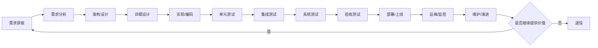

# 软件生命周期思维笔记

## 1. 核心理解

软件生命周期不是“写代码 → 上线”，而是覆盖：

**构想 → 需求 → 设计 → 开发 → 测试 → 部署 → 运行 → 维护 → 退役**

核心标准依据：

- GB/T 8566-2022
- ISO/IEC/IEEE 12207
- Scrum Guide
- Agile Manifesto
- XP
- DevOps / DORA 指标体系

关键结论：

> 生命周期模型决定“流程怎么组织”；工程实践决定“每个阶段怎么做”；DevOps / CI/CD 决定“如何持续交付和稳定运行”。

---

## 2. 软件生命周期主流程

---

## 3. 各阶段笔记

### 3.1 需求获取

目标：弄清楚为什么做、做给谁、解决什么问题。

主要活动：

- 访谈用户
- 梳理业务流程
- 明确范围边界
- 识别干系人
- 形成初始需求池

产出物：

- 业务目标
- 问题陈述
- 范围边界
- 干系人清单
- 初始需求池

质量点：

- 目标是否明确
- 边界是否清楚
- 关键假设是否记录

---

### 3.2 需求分析

目标：把业务诉求转成可开发、可测试、可验收的需求。

主要活动：

- 编写用户故事 / 用例
- 定义优先级
- 明确验收标准
- 梳理非功能需求
- 建立需求追踪关系

产出物：

- Product Backlog
- SRS / 用例模型
- 验收标准
- 非功能需求清单
- 风险清单

质量点：

- 需求是否可理解
- 需求是否可测试
- 验收标准是否明确

---

### 3.3 架构设计

目标：确定系统整体结构和关键技术方案。

主要活动：

- 划分系统模块
- 定义服务边界
- 设计接口关系
- 规划数据流
- 验证关键风险点

产出物：

- 架构图
- ADR 架构决策记录
- 接口边界
- 部署视图
- 风险应对方案

质量点：

- 高风险技术是否验证
- 性能、安全、扩展性是否考虑
- 架构是否支撑后续演进

---

### 3.4 详细设计

目标：把架构方案细化成开发可执行的设计。

主要活动：

- 模块设计
- API 合同设计
- 数据库设计
- 异常处理设计
- 状态机 / 时序设计

产出物：

- 详细设计说明
- API 文档
- 数据模型
- 数据迁移方案
- 测试依据

质量点：

- 接口是否一致
- 边界条件是否完整
- 异常场景是否覆盖

---

### 3.5 实现 / 编码

目标：按照需求和设计完成代码实现。

主要活动：

- 编码
- 代码评审
- 主干集成
- 构建脚本
- 配置管理

产出物：

- 源代码
- 构建脚本
- 配置模板
- 容器镜像
- 数据库脚本

质量点：

- 代码评审是否通过
- 构建是否可重复
- 代码规范是否通过
- 主干是否保持可集成

---

### 3.6 单元测试

目标：验证单个函数、类、模块是否正确。

主要活动：

- 编写单元测试
- Mock 外部依赖
- 覆盖边界条件
- 覆盖异常分支

产出物：

- 单元测试用例
- 覆盖率报告
- Mock / Stub
- 测试夹具

质量点：

- 单测是否随代码提交
- 失败测试是否及时修复
- 核心逻辑是否被覆盖

---

### 3.7 集成测试

目标：验证模块、服务、接口之间是否能正常协作。

主要活动：

- API 测试
- 契约测试
- 服务间调用测试
- 数据流验证
- 测试环境验证

产出物：

- 集成测试套件
- 接口测试报告
- 契约测试结果
- 测试环境配置

质量点：

- 接口是否兼容
- 数据传递是否正确
- 关键交互是否可重复验证

---

### 3.8 系统测试

目标：验证完整系统是否满足功能和非功能要求。

主要活动：

- 功能测试
- 端到端测试
- 性能测试
- 安全测试
- 稳定性测试

产出物：

- 系统测试用例
- 测试报告
- 缺陷单
- 发布建议

质量点：

- 需求覆盖是否完整
- 关键非功能指标是否达标
- 退出条件是否明确

---

### 3.9 验收测试

目标：确认系统是否满足业务和用户接受标准。

主要活动：

- UAT 用户验收
- OAT 运维验收
- 业务流程验证
- 上线决策

产出物：

- 验收记录
- 签署意见
- 上线决策
- UAT / OAT 结果

质量点：

- 验收标准是否满足
- 业务流程是否跑通
- 运维是否可接管

---

### 3.10 部署 / 上线

目标：把系统稳定、安全、可回退地发布到生产环境。

主要活动：

- 制品发布
- 环境准备
- 数据迁移
- 流量切换
- 回滚准备

产出物：

- 发布包
- 上线方案
- 变更记录
- 回滚方案
- 发布说明

质量点：

- 部署是否可重复
- 环境是否一致
- 回滚方案是否验证

---

### 3.11 运维 / 监控

目标：保证系统持续稳定运行，并把运行反馈转回需求。

主要活动：

- 日志监控
- 指标监控
- 链路追踪
- 告警处理
- 故障恢复
- 事故复盘

产出物：

- 运行手册
- 监控面板
- 告警规则
- 事故单
- 复盘记录

质量点：

- 关键路径是否被监控
- 告警是否有效
- 恢复时间是否可度量

---

### 3.12 维护 / 演进

目标：持续修复缺陷、升级依赖、优化性能、支持新需求。

主要活动：

- 缺陷修复
- 依赖升级
- 重构
- 性能优化
- 新需求迭代

产出物：

- Patch
- 变更请求
- 更新后的文档
- 新版本增量

质量点：

- 变更影响是否分析
- 回归测试是否完成
- 版本和配置是否一致

---

### 3.13 退役

目标：安全停止旧系统，处理数据、依赖和用户迁移。

主要活动：

- 下线规划
- 数据迁移 / 导出
- 数据保留
- 用户通知
- 依赖清理
- 文档归档

产出物：

- 退役计划
- 数据保留记录
- 下线确认
- 归档文档

质量点：

- 用户是否迁移完成
- 数据是否按要求保留
- 旧依赖是否清理完成

---

## 4. 常见生命周期模型

| 模型 | 核心思想 | 适合场景 |
|---|---|---|
| 瀑布模型 | 阶段顺序推进 | 需求稳定、合同明确、审计要求强 |
| V 模型 | 开发阶段与测试阶段对应 | 强验证、强追踪、软硬件集成 |
| 迭代 / 增量 | 分批交付、逐步演进 | 需求变化、希望早交付价值 |
| Scrum | 用 Sprint 管理节奏 | 小型跨职能团队、复杂产品开发 |
| XP | 用工程实践保证质量 | 需求变化快、重视自动化测试 |
| DevOps | 开发、测试、部署、运行一体化 | 在线服务、持续发布、平台型系统 |
| 持续交付 | 系统始终保持可发布状态 | 高频发布、自动化程度高的团队 |
| Spiral | 风险驱动开发 | 高风险、高不确定性、大型复杂系统 |
| RUP | 迭代、用例驱动、架构中心 | 中大型企业级项目 |

---

## 5. 推荐主线

多数业务软件的默认最佳路线：

> 迭代 / 增量开发  
> + Scrum 节奏管理  
> + XP 工程实践  
> + CI/CD 自动化  
> + DevOps 运维反馈

简化成一句话：

**小步交付、早验证、自动化测试、可观测运行、持续改进。**

---

## 6. 质量控制重点

核心原则：

- 需求要可验收
- 架构风险要提前验证
- 测试要前移
- 构建要自动化
- 部署要可重复
- 上线要可回滚
- 运行要可观测
- 退役要有计划

---

## 7. 关键风险与处理方式

| 风险 | 常见阶段 | 处理方式 |
|---|---|---|
| 需求变更频繁 | 需求阶段 | 使用 Backlog、优先级、验收标准 |
| 非功能需求遗漏 | 需求 / 架构 | 显式列出性能、安全、扩展性要求 |
| 架构选型错误 | 架构设计 | PoC 验证关键假设 |
| 测试后置 | 开发 / 测试 | 单测、集成测试、CI 前移 |
| 环境不一致 | 集成 / 部署 | IaC、配置版本化 |
| 发布失败 | 上线 | 小批量发布、灰度、回滚方案 |
| 监控不足 | 运维 | 日志、指标、链路追踪、告警 |
| 旧系统长期残留 | 维护 / 退役 | 资产清单、退役计划、数据归档 |

---

## 8. 核心度量指标

### 8.1 质量类

- 缺陷密度
- 测试覆盖率
- 缺陷逃逸率
- 构建成功率

### 8.2 交付效率类

- 部署频率
- 变更交付周期

### 8.3 稳定性类

- 变更失败率
- 故障恢复时间
- 部署返工率

推荐组合：

> 缺陷密度 + 覆盖率 + 缺陷逃逸率  
> + 部署频率 + 变更交付周期  
> + 变更失败率 + 故障恢复时间

---

## 9. 团队规模下的流程选择

### 9.1 5～15 人团队

推荐：

- 一个跨职能产品团队
- 一个主 Backlog
- 短迭代
- CI/CD
- 自动化测试
- 简洁文档

适合方式：

**迭代 / 增量 + Scrum + XP + 基本 CI/CD**

---

### 9.2 50 人以上团队

推荐：

- 拆成多个小型跨职能团队
- 按产品域或价值流组织
- 建立统一工程规范
- 建立平台能力
- 统一测试、发布、监控和度量方式

适合方式：

**多团队迭代 + 平台工程 + DevOps + 统一质量治理**

---

## 10. 最终记忆版

软件生命周期可以记成 13 个阶段：

1. 需求获取
2. 需求分析
3. 架构设计
4. 详细设计
5. 实现 / 编码
6. 单元测试
7. 集成测试
8. 系统测试
9. 验收测试
10. 部署 / 上线
11. 运维 / 监控
12. 维护 / 演进
13. 退役

一句话总结：

> 软件生命周期的本质，是让软件从想法变成可运行系统，再持续稳定地产生价值，最后安全退出。
