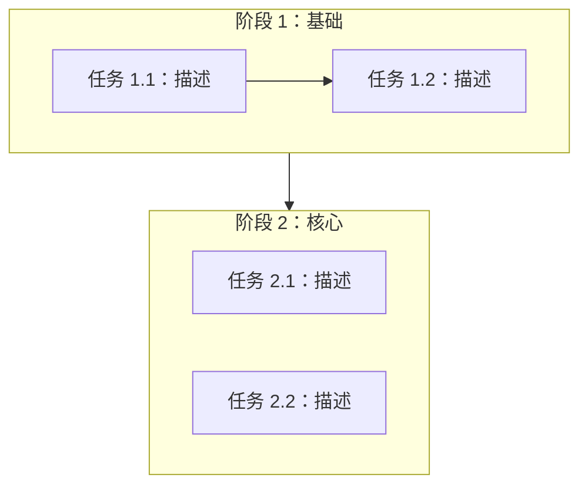

# 计划文档模板

阶段 3（任务拆解）产出的三份文档模板。输出到 `docs/plan/`。

---

## task-breakdown.md

```markdown
# 任务拆解

## 概览
- **阶段总数**：N
- **任务总数**：N
- **预估总工作量**：S/M/L/XL

## S.U.P.E.R 设计约束

> 本计划中所有任务的代码产出须符合 S.U.P.E.R 架构原则。全局约束如下：

- **S（单一职责）**：每个新模块/文件/函数只解决一个问题；若一项任务跨多个职责，继续拆分。
- **U（单向流动）**：数据为 输入→处理→输出；依赖向内；禁止循环引用。
- **P（端口优于实现）**：先定义接口契约（schema、类型），再实现；跨模块 I/O 须可序列化。
- **E（环境无关）**：禁止硬编码配置；环境相关值来自环境变量或配置文件。
- **R（可替换部件）**：每个组件应可替换而不连锁修改。用替换测试自问：「能否只改本模块就换成另一种实现？」

## 可执行性约束（反占位）

> 计划必须可直接执行，避免空话或占位描述。

- 尽量给出**明确文件路径**（至少到目录或关键文件级别）。
- 每个任务必须有**可验证的验收标准**，不能只写抽象目标。
- 若涉及测试、构建或脚本，尽量写明**具体命令、验证入口或检查方式**。
- 对实现型任务，至少说明：**改哪些文件、如何验证、何时可标记完成**。
- 禁止占位式描述：`TBD`、`TODO`、`implement later`、`add appropriate error handling`、`write tests for the above`、`similar to previous task`。
- 禁止只有抽象动作、没有最小执行信息（路径、验证方式、完成判据）。

## 阶段 1：<阶段名>
**目标**：本阶段达成什么
**前置条件**：进入本阶段前须完成什么
**S.U.P.E.R 重点**：本阶段最相关的原则（例如「P — 先定义模块间契约再实现」）

| # | 任务 | 优先级 | 工作量 | 依赖 | 泳道 | 目标文件路径 | S.U.P.E.R | 验收标准 | 验证方式/命令 |
|:--|:-----|:-------|:-------|:-----|:-----|:-------------|:----------|:---------|:--------------|
| 1 | | P0 | M | — | A | | S, P | | |
| 2 | | P1 | S | — | B | | U, E | | |
| 3 | | P1 | S | 1 | A | | R | | |

> **S.U.P.E.R 列**：该任务的主要设计约束；验收标准隐含「对所列原则通过 S.U.P.E.R 快速检查」。
>
> **验收与验证列**：不可留空；至少填入可执行检查（命令、测试入口、对比点或可观察结果）。

### 并行泳道
| 泳道 | 任务 | 合计工作量 | 合并风险 | 关键文件 |
|:-----|:-----|:-----------|:---------|:---------|
| A | 1, 3 | M | 低 | |
| B | 2 | S | 低 | |

> 不同泳道任务互不依赖。若合并风险可接受，可由不同人或不同会话并行；否则按泳道串行。合并风险表示泳道间文件冲突的可能性。

## 阶段 2：<阶段名>
<!-- 结构同阶段 1 -->
```

---

## dependency-graph.md

````markdown
# 任务依赖图


````

---

## milestones.md

```markdown
# 里程碑

| # | 里程碑 | 目标阶段后 | 达成标准 | 状态 |
|:--|:-------|:-----------|:---------|:-----|
| 1 | | 阶段 1 后 | | 待完成 |
| 2 | | 阶段 3 后 | | 待完成 |
```
